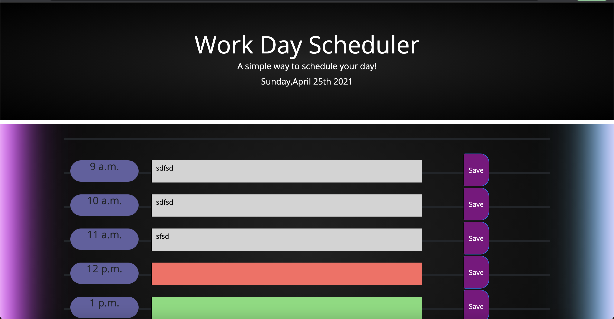

In this assignment I was challenged to create a day planner. This was an interesting and refreshing assignemnt to complete, especially coming from doing the most challenging assignment I have had so far in this bootcamp. Finding a way to get my text to display and save was challenging until I figured out I had my variables mixed up (of course). I learned that psudeocoding is extremely crucial in order to start a project. Breaking down a problem one step at a time, has helped me think of multiple ways to solve a problem.

[Link to deployed Webpage](https://github.com/TemiFemi/WorkDaySchedule)

## Screenshot of Portfolio Website
